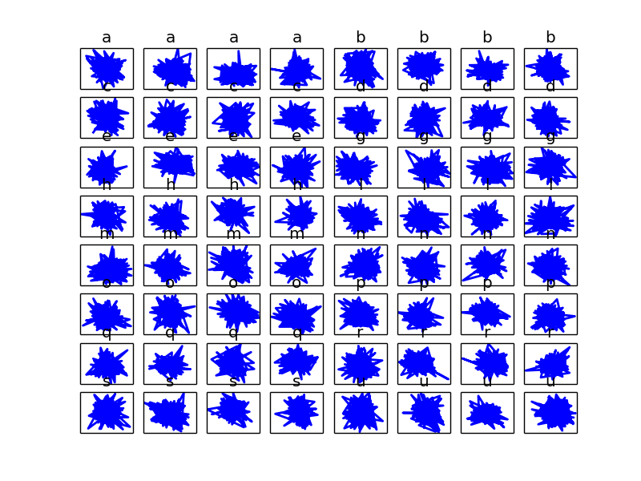
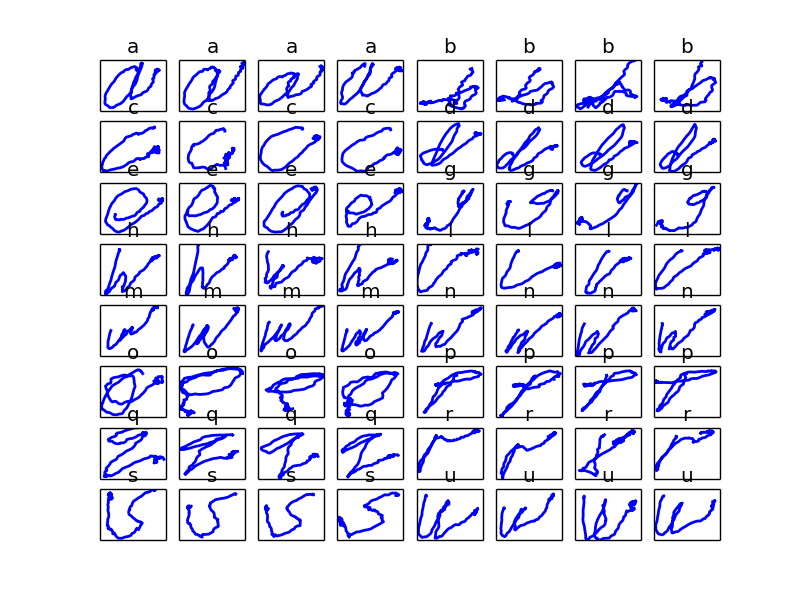
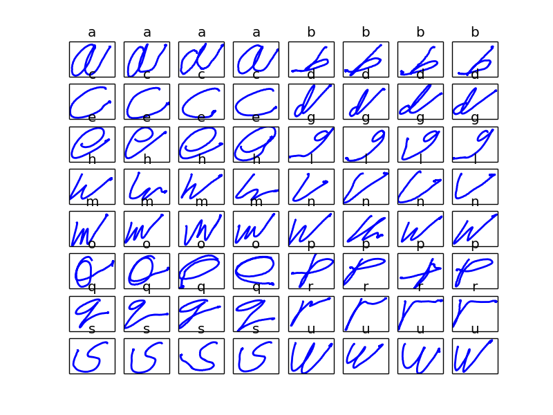
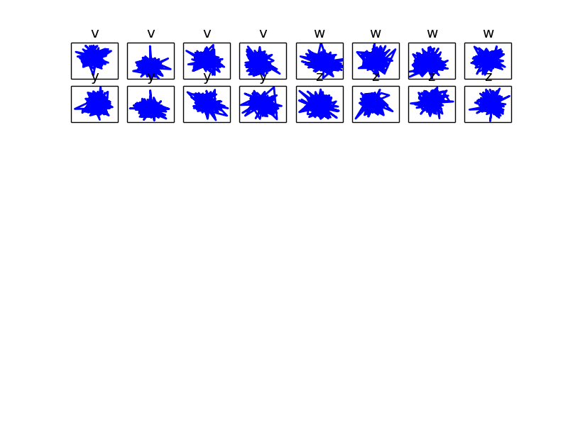
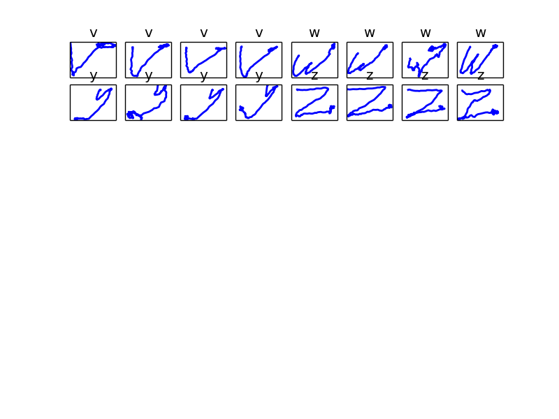
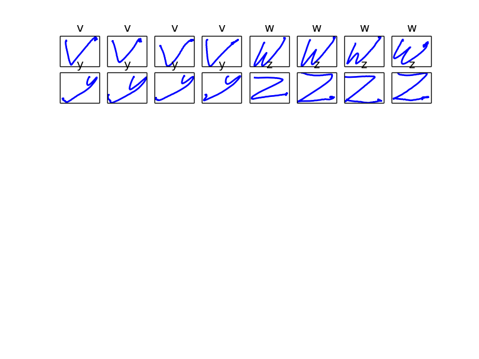
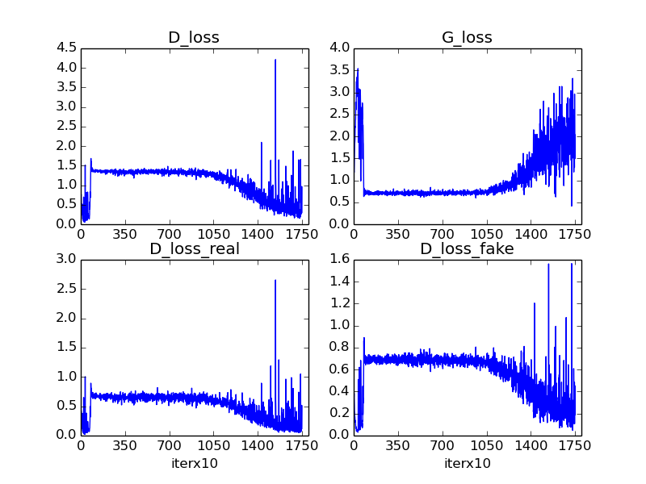

# CGAN for temporal series generation

## Introduction

Generate timeseries under the control of label.

## Dependencies

- Tensorflow 

## Usage

```python
    python cgan.py
```

## Datasets

Name | Link | Class | Dimension | Train Size | Test Size | Truncated
:---: | :---: | :---: | :---: | :---: | :---: | :---:
CharacterTrajectories | [Download](http://timeseriesclassification.com/description.php?Dataset=CharacterTrajectories) | 20 | 3 | 1422 | 1436 | 182

### Generate npz file

Unzip *CharacterTrajectories.zip* at  `data/CharacterTrajectories`, then run `dataprocess.py`.

```python
    python dataprocess.py
```

## Generated Sequences

part | Epoch 0 | Epoch 200 | Epoch 500 |
| :---: | :---: | :---: | :---: |
part 1 |  |  |  |
part 2 |  |  |  |

## Loss



